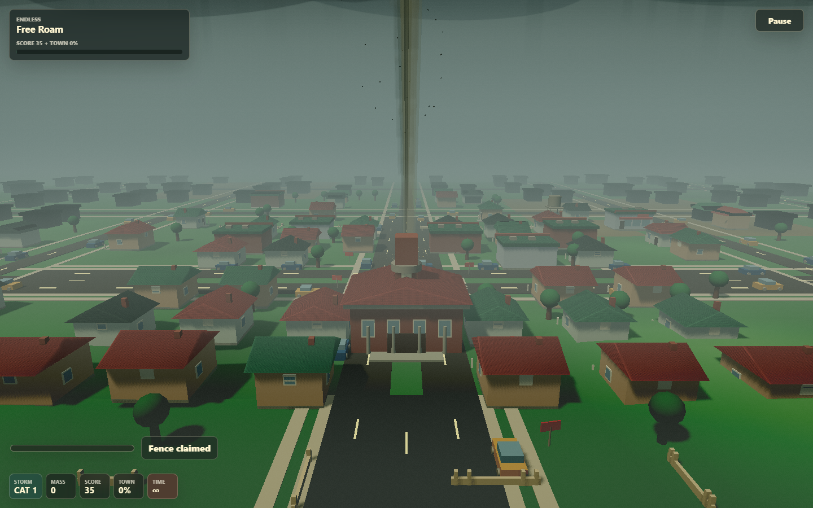
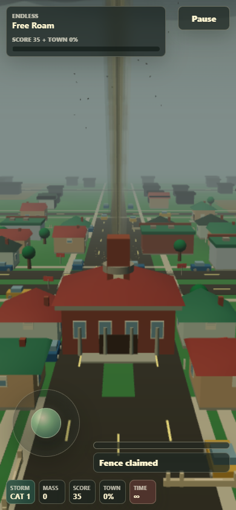
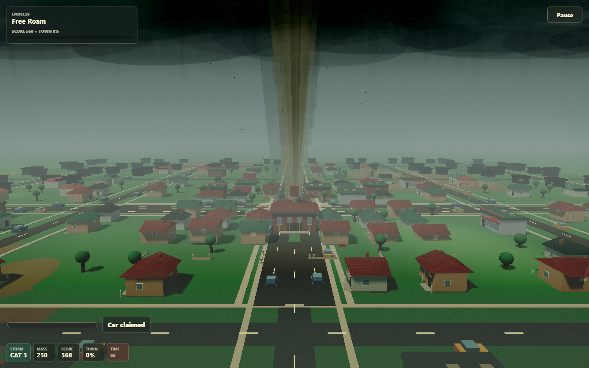
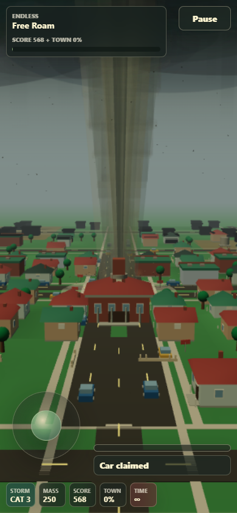
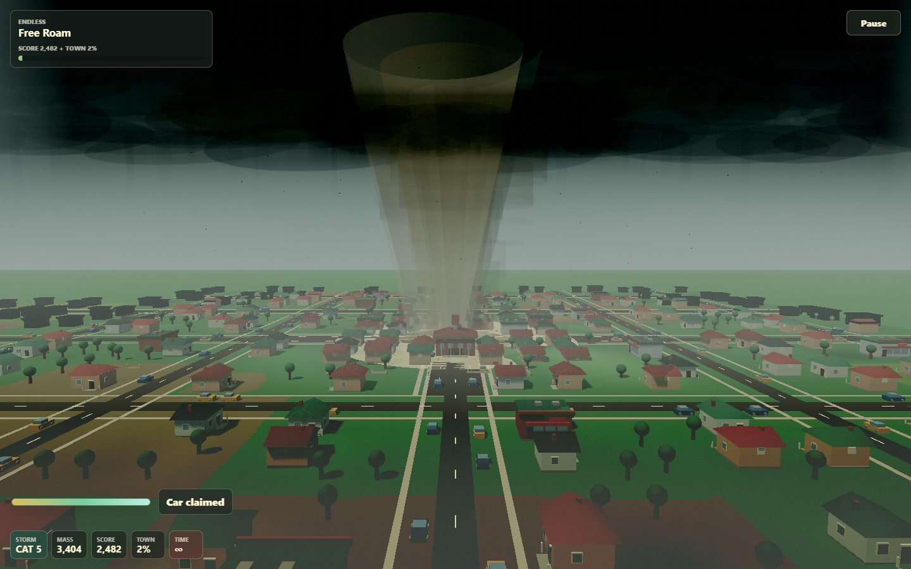
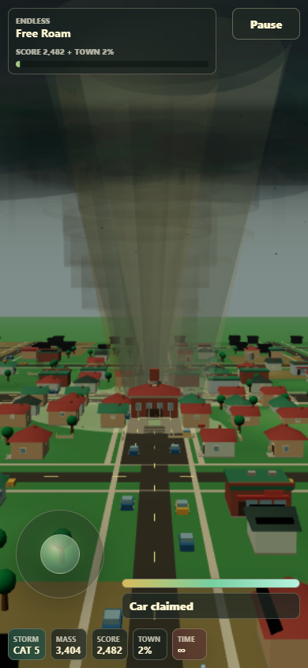

# Townfall Tornado V1 Rebuild Baseline

Status: locked reference for the v2 rebuild

This report preserves the visual and runtime state that v2 must improve. The
captures are intentionally unedited: visible rendering defects are part of the
baseline, not defects to hide before comparison.

## Reproduce

From the repository root:

```powershell
npm.cmd run baseline:v1
```

The command starts the Vite server on `127.0.0.1:5175` when needed, launches a
supported local Chromium browser, captures desktop High and mobile Low cases,
and rewrites `docs/rebuild/baseline/v1/`. On the v2 branch it boots the frozen
prototype through the local-only `legacy-v1.html` entrypoint, so the active
`GameApp` runtime remains isolated.

The structured source of truth is
[metrics.json](./baseline/v1/metrics.json). Headless-browser FPS is useful for
relative comparisons on the same machine, but it is not a general hardware
benchmark.

## Provenance

- Captured: 2026-07-26
- Runtime baseline tag: `v0.1.0.0`
- Runtime baseline commit: `f5fca1d7f7790f3e55b59faff05db49678a29ddd`
- Capture tooling commit: `528f71d8ace588291c379bc44ecccd7a52c67a94`
- Branch: `rebuild/v2`
- Browser: Microsoft Edge 150.0.4078.99
- Desktop viewport: 1440x900, High quality
- Mobile viewport: 390x844, Low quality
- Capture errors: none
- Preserved production: `master` at `b259ad6`
- Rebuild preview:
  `https://townfall-tornado-git-rebuild-v2-anthony-polito-s-projects.vercel.app/`

## Reference Frames

### Category 1

| Desktop High | Mobile Low |
| --- | --- |
|  |  |

### Category 3

| Desktop High | Mobile Low |
| --- | --- |
|  |  |

### Category 5

| Desktop High | Mobile Low |
| --- | --- |
|  |  |

## Runtime Snapshot

Category captures use masses 0, 250, and 3,404. The oversized stress case
starts at mass 12,000 and lets destruction run long enough to pressure both
visual debris pools.

| Device | Case | FPS | Avg frame | Draws | Objects | Geometries | Particles | Hero chunks |
| --- | --- | ---: | ---: | ---: | ---: | ---: | ---: | ---: |
| Desktop High | Cat 1 | 70.9 | 14.05 ms | 1,413 | 2,742 | 1,881 | 22 | 2 |
| Desktop High | Cat 3 | 155.0 | 6.43 ms | 2,096 | 3,513 | 2,207 | 62 | 4 |
| Desktop High | Cat 5 | 106.3 | 9.42 ms | 3,198 | 4,768 | 3,140 | 386 | 11 |
| Desktop High | Stress | 156.5 | 6.37 ms | 437 | 3,696 | 4,304 | 6,845 | 340 |
| Mobile Low | Cat 1 | 158.2 | 9.62 ms | 734 | 2,237 | 1,241 | 31 | 2 |
| Mobile Low | Cat 3 | 164.5 | 6.06 ms | 1,078 | 2,813 | 1,329 | 25 | 3 |
| Mobile Low | Cat 5 | 162.2 | 6.17 ms | 1,454 | 3,200 | 1,597 | 127 | 10 |
| Mobile Low | Stress | 164.2 | 6.10 ms | 220 | 3,696 | 2,012 | 6,672 | 340 |

The low stress draw counts are not an efficiency success: by that sample, much
of the nearby detailed town has already been destroyed or hidden. The more
important stress result is that particles reach 6,845 of 7,000 desktop slots
and 6,672 mobile slots while all 340 hero-chunk slots are occupied.

The fixed category scenes also expose scaling pressure:

- Desktop draw calls rise from 1,413 at Cat 1 to 3,198 at Cat 5.
- Desktop scene objects rise from 2,742 to 4,768.
- Desktop detailed town items rise from 217 to 392.
- Active destruction candidates rise from 24 to 220.
- All fixed captures hold 34 generated chunks and 841 town items, so this is
  category/detail promotion cost rather than a larger sampled world.

## Hitch Accounting

The v1 diagnostics now use a three-second warmup phase. Page load and shader
compilation samples are recorded separately, then steady gameplay counters
begin:

| Device | Startup frames | Startup hitches | Worst startup frame |
| --- | ---: | ---: | ---: |
| Desktop High | 324 | 2 | 731.4 ms |
| Mobile Low | 422 | 1 | 265.4 ms |

Gameplay hitches remain visible instead of being forgiven. The desktop session
recorded a 230.9 ms post-warmup hitch, and the mobile session recorded a 529.6 ms
maximum frame. Scenario transitions share one browser session, so Milestone 1
diagnostics should add per-scenario resets and p95 frame/work timing before
performance-gate decisions are made.

## Visual Findings

- The funnel reads as stacked translucent, straight-edged geometry instead of
  turbulent condensation.
- Cat 5 exposes circular funnel rims and broad elliptical storm-deck layers.
- The storm base darkens the sky but does not form a convincing wall cloud,
  inflow structure, or rain-wrapped supercell.
- The repeated road grid, lot spacing, and flat terrain make the generated
  world read as tiled rather than geographic.
- Distant house LODs become dark silhouettes, and their proxy/detail handoff is
  still visible in both desktop and mobile frames.
- Buildings are readable but share too little shape, footprint, material, and
  district variation.
- Category zoom communicates scale, but higher categories reveal the renderer's
  layers and town repetition more clearly.
- The 390x844 HUD and joystick remain usable, giving v2 a concrete mobile
  layout behavior to preserve.

## V2 Comparison Gates

| Measure | V1 Cat 5 desktop | V2 budget |
| --- | ---: | ---: |
| Draw calls | 3,198 | At most 450 |
| Live scene objects | 4,768 | At most 1,500 |
| Detailed destructible items | 392 | At most 160 |
| Hero chunks under stress | 340 / 340 | Bounded without persistent saturation |
| Particles under stress | 6,845 / 7,000 | Bounded, quality-scaled, at most 6 particle draws |
| Post-warmup hitch | 230.9 ms observed | No hitch over 100 ms |

Frame-time acceptance remains the roadmap's p95 budget, not the instantaneous
FPS shown here. Future milestones should recapture this same matrix and append a
v2 result rather than changing the v1 reference.
